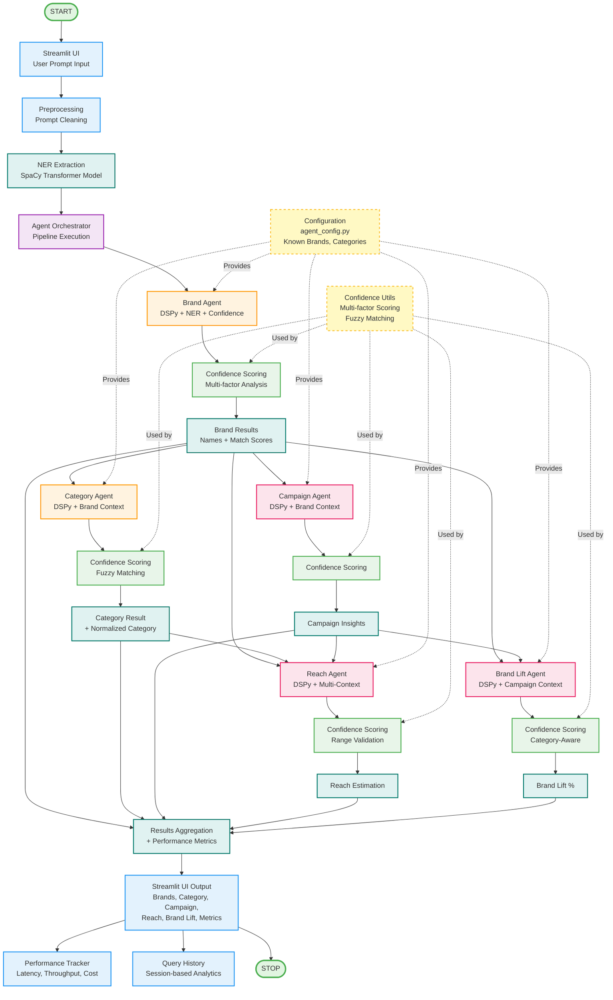

# Agentic Brand Classifier V3 - System Architecture

## Mermaid Diagram Code



## How to Generate/View the Diagram

### Option 1: Online Mermaid Editors (Recommended)
1. **Mermaid Live Editor**: https://mermaid.live/
   - Copy the code above (everything between ```mermaid and ```)
   - Paste into the editor
   - View and export as PNG/SVG

2. **GitHub/GitLab**: 
   - Create a `.md` file with the code
   - Push to GitHub/GitLab
   - View directly in the repository

### Option 2: VS Code Extension
1. Install "Markdown Preview Mermaid Support" extension
2. Open this `.md` file
3. Use Markdown preview (Cmd+Shift+V / Ctrl+Shift+V)

### Option 3: Command Line (Mermaid CLI)
```bash
npm install -g @mermaid-js/mermaid-cli
mmdc -i system_architecture_v3.md -o diagram.png
```

### Option 4: Documentation Sites
- **Notion**: Supports Mermaid diagrams
- **Confluence**: With Mermaid plugin
- **Obsidian**: Native Mermaid support

## Architecture Overview

### Core Components

1. **Streamlit UI** (`ui/app.py`)
   - User interface for prompt input
   - Results visualization
   - Performance metrics dashboard
   - Query history and analytics

2. **NER Extraction** (`brand_extraction/entity_extractor.py`)
   - Uses SpaCy transformer model (`en_core_web_trf`)
   - Extracts named entities (ORG, PERSON, etc.)
   - Provides context for brand agent

3. **Agent Orchestrator** (`agent/orchestrator.py`)
   - Coordinates all agents
   - Manages execution order
   - Passes context between agents
   - Tracks performance metrics

### Agent Pipeline

#### Phase 1: Core Agents (Always Enabled)
- **Brand Agent**: Extracts brand names using DSPy + NER
- **Category Agent**: Infers category using DSPy + Brand context

#### Phase 2: Context-Dependent Agents (Optional)
- **Campaign Agent**: Requires Brand context
- **Reach Agent**: Requires Brand, Category, Campaign context
- **Brand Lift Agent**: Requires Brand, Campaign context

### Key Features

1. **Intelligent Context Passing**
   - Brand results inform Category extraction
   - Campaign uses Brand context
   - Reach uses Brand + Category + Campaign
   - Brand Lift uses Brand + Campaign

2. **Confidence Scoring** (`utils/confidence_scoring.py`)
   - Multi-factor confidence calculation
   - Fuzzy matching for accuracy
   - Context-aware adjustments
   - Range validation for numeric predictions

3. **Configuration Management** (`config/agent_config.py`)
   - Centralized configuration
   - Known brands, categories, keywords
   - External JSON override support
   - Environment variable support

4. **Performance Tracking** (`utils/performance.py`)
   - Real-time latency tracking
   - Throughput metrics
   - Cost comparison (Ollama vs Cloud APIs)
   - System resource monitoring

## Execution Flow

1. **User Input** → Streamlit UI receives prompt
2. **Preprocessing** → Prompt cleaned and prepared
3. **NER Extraction** → Entities extracted using SpaCy
4. **Orchestrator** → Manages agent pipeline execution
5. **Phase 1 Agents**:
   - Brand Agent extracts brands (uses NER + DSPy)
   - Category Agent infers category (uses Brand context + DSPy)
6. **Phase 2 Agents** (if enabled):
   - Campaign Agent (uses Brand)
   - Reach Agent (uses Brand + Category + Campaign)
   - Brand Lift Agent (uses Brand + Campaign)
7. **Results Aggregation** → All results combined with metrics
8. **UI Output** → Results displayed with visualizations
9. **Tracking** → Performance metrics and query history updated

## Technology Stack

- **UI**: Streamlit
- **NER**: SpaCy Transformer Model
- **LLM**: DSPy with Ollama (phi3)
- **Visualization**: Plotly
- **Performance**: psutil for system metrics
- **Configuration**: Python config module with JSON override

## Benefits

1. **Cost Efficiency**: Local Ollama processing (90%+ savings vs cloud APIs)
2. **Intelligent Orchestration**: Context-aware agent chaining
3. **Confidence Scoring**: Multi-factor reliability metrics
4. **Performance Tracking**: Real-time metrics and analytics
5. **Scalability**: Batch processing with parallel execution
6. **Maintainability**: Centralized configuration and modular design

